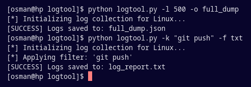

# logtool

A versatile Python utility designed to aggregate system logs and terminal histories across **Windows**, **Linux**, and **macOS**.
It provides a unified interface to collect, filter, and export logs for debugging or security auditing.



---

## Prerequisites

Before running the script, install the necessary dependencies:

```bash
pip install -r requirements.txt
```

## Available Commands
1. Default Execution
Retrieves the last 20 entries for each category and saves them to log_report.json.
```bash
python logtool.py
```

2. Output Format (-f or --format)
Switch between machine-readable JSON or human-readable TXT.
```bash
# Export as a plain text file
python logtool.py --format txt
```

3. Keyword Filtering (-k or --keyword)
Filter logs to only include entries containing a specific string (case-insensitive).
```bash
# Extract all logs containing the word "error"
python logtool.py --keyword error
```

5. Custom Filename (-o or --output)
Define the output filename (the extension is added automatically).
```bash
# Save to "security_scan.txt"
python log_extractor.py --format txt --output security_scan
```

## Usage Examples

| Goal | Command |
|---|---|
| High-priority errors | python logtool.py -f txt -l 50 -k critical -o errors |
| Terminal command search | python logtool.py -k "git push" -f txt |
| Full system dump | python logtool.py -l 500 -o full_dump |

## Data Coverage

| Category | Windows Source | Unix Source (Linux/macOS) |
|---|---|---|
| System Logs | Event Viewer (System Log) | journalctl  or  /var/log/syslog |
| Terminal History | PowerShell (PSReadLine) | .bash_history  or  .zsh_history |
